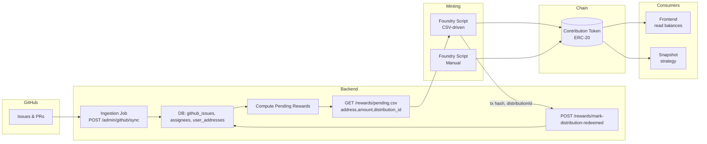

## Contribution Token — Specification and Architecture

This document defines the architecture, responsibilities, and operational flows for the Contribution Token. The Contribution Token is the unique, on-chain source of truth for contributor rewards. All downstream systems (frontend UI, Snapshot voting, analytics) must derive balances from the blockchain.

### Core Principles
- **On-chain source of truth**: Balances exist only on chain; off-chain systems must not maintain parallel balances.
- **Deterministic and reproducible**: Mints are driven by explicit inputs (manual or CSV) and produce auditable on-chain events.
- **Idempotent distributions**: Each distribution can be uniquely identified and safely re-run without double minting.
- **Separation of concerns**: Backend handles data ingestion and reward calculation; Foundry scripts mint; contract enforces rules; frontend reads and displays.

---

## System Components

### 1) Smart Contract (on chain)
Responsible for holding balances and enforcing mint permissions.

- **Standard**: ERC-20 (recommended with OpenZeppelin) with optional `Votes` extension if Snapshot needs delegation via token checkpoints.
- **Key functions**:
  - `mint(address to, uint256 amount)` — restricted to `MINTER_ROLE` or `owner`.
  - `mintBatch(address[] calldata to, uint256[] calldata amounts)` — gas-efficient batch mint.
  - Optional: `recordDistribution(bytes32 distributionId)` and `isDistributionProcessed(bytes32 distributionId)` for idempotency.
- **Roles & access**:
  - `DEFAULT_ADMIN_ROLE` / `owner` for governance.
  - `MINTER_ROLE` granted to deployer’s operational key or a multisig.
- **Events**:
  - `Minted(address indexed to, uint256 amount, bytes32 indexed distributionId)`
  - `BatchMinted(bytes32 indexed distributionId)`
- **Configurables**:
  - Token name/symbol/decimals.
  - Optional pausability.
  - Optional upgradeability with UUPS and a proxy (only if needed).

Notes:
- If Snapshot strategy only needs raw balances, `erc20-balance-of` is sufficient. If requiring historical checkpointing/delegation, consider `ERC20Votes`.

### 2) Minting Workflows (Foundry scripts)
Two minting sources feed the contract:

1. **Manual mint** (arbitrary decision)
   - Operator supplies `(address, amount[, distributionId])` directly to a script.
   - Used for ad hoc rewards, backfills, or manual corrections.

2. **CSV-driven mint** (automated from backend)
   - Script reads a CSV of `address,amount[,distribution_id]` from the backend endpoint.
   - Performs batch mints with on-chain tagging of `distributionId` for idempotency.
   - Writes a local execution report (tx hash, gas used, successes/failures).

Operational recommendations:
- Use a unique `distributionId` per CSV (e.g., `keccak256(repo@commitHash|timestamp|range)`), stored on-chain to prevent double-minting.
- Chunk large batches to respect block gas limits.
- Dry run mode for validation without broadcasting.

### 3) Backend Service (GitHub ingestion and rewards computation)
Responsible for building a credible, reproducible CSV of pending rewards derived from GitHub issues.

Responsibilities:
- **Ingest GitHub issues** from one or more repositories:
  - Store issue metadata: `github_issue_id`, `title`, `state`, `labels`, `points`, `closed_at`, `html_url`.
  - Store assignments: `assignee_login` (GitHub usernames) and many-to-many mappings.
  - Only closed issues qualify for rewards.
- **Address mapping**:
  - Maintain a mapping of `github_login -> evm_address` with verification (e.g., user signs a message on-chain or via SIWE; store signature proof).
- **Reward computation**:
  - Aggregate closed, unrewarded issues per address; compute `pending_amount` using policy: sum(points) × multiplier.
  - Policy can consider labels (e.g., `priority:high`), tags, or per-repo weights.
- **Distribution management**:
  - Build a `distributionId` for each CSV.
  - Mark issues as `rewarded=true` only after the mint transaction is confirmed and reconciled.

Endpoints (suggested):
- `POST /admin/github/sync` — triggers ingestion/sync from GitHub (idempotent, pageable; can be scheduled via cron).
- `GET /rewards/pending.csv` — returns `address,amount,distribution_id` for all addresses with pending rewards.
- `POST /rewards/mark-distribution-redeemed` — body includes `distributionId`, `txHash`; marks associated issues as rewarded post-confirmation.

Data tables (suggested):
- `github_issues` — core issue metadata and reward status flags.
- `github_issue_assignees` — join table for issue↔assignees.
- `user_addresses` — `github_login`, `evm_address`, `verification_proof`.
- `distributions` — `distribution_id`, `created_at`, `csv_snapshot_uri`, `status`.
- `distribution_lines` — `distribution_id`, `evm_address`, `amount`.
- `reward_events` — audit of mints, `tx_hash`, `block_number`, `distribution_id`.

### 4) Frontend Integration
- Read token balances directly from the chain via RPC and display on contributor profiles.
- Use environment variables for `CHAIN_ID` and `CONTRIBUTION_TOKEN_ADDRESS`.
- Optional: Surface per-user reward history by joining on-chain events with backend records.

### 5) Snapshot Integration
- Use existing `erc20-balance-of` strategy if raw balances are sufficient.
- If vote power must snapshot at specific blocks or support delegation, deploy `ERC20Votes` and configure Snapshot to read checkpoints or use a compatible strategy.

---

## End-to-End Flow



---

## Operational Details

### Contract Deployment
- Deploy token with name/symbol/decimals.
- Assign `MINTER_ROLE` to operational key or multisig.
- Store deployed address in environment/config for backend, frontend, and Snapshot.

### Mint Idempotency
- Generate `distributionId = keccak256(csvBytes)` or a stable composition like `keccak256(repo|from_closed_at|to_closed_at|csv_sha256)`.
- On chain, maintain `processed[distributionId] = true` after successful mint; revert if re-used.
- Alternatively, rely on backend `distributions.status` + operator discipline, but on-chain guard is safer.

### CSV Schema
Required columns:
- `address` — EVM address (checksum preferred)
- `amount` — integer in smallest units (respect token decimals)
- `distribution_id` — same value for all lines in a single file

Validation rules (script-side):
- All addresses valid and non-zero.
- Amounts > 0.
- Sum amounts matches expected total; log summary.
- Dry-run prints parsed lines and computed `distributionId`.

### Backend Reward Policy (example)
- Issue points can be provided via labels (e.g., `points:3`) or stored in a custom field.
- Pending amount per address = sum of points for closed, unrewarded issues × global multiplier (e.g., `10^18` for decimals).
- Multi-assignee split: divide points equally or by label weights.

### Security & Governance
- Use a hardware wallet or multisig for the `MINTER_ROLE`.
- Restrict admin endpoints with auth (e.g., API keys, OAuth, or mTLS).
- Record audit logs for CSV generation, mints, and reconciliation.
- Rate-limit and monitor ingestion tasks to respect GitHub API limits.
- Consider a pause mechanism in the contract for emergency response.

### Monitoring & Observability
- Track: ingestion lag, number of pending rewards, last distribution time, mint gas usage, failure counts.
- Emit metrics and alerts for failed syncs, CSV generation errors, or mint reverts.

### Testing Strategy
- Unit tests:
  - Contract access control and idempotency.
  - Foundry script parsing and batching.
- Integration tests:
  - Backend → CSV → mint → on-chain events → reconciliation.
  - Snapshot strategy reads correct balances.
- Staging dry runs with small distributions and canary recipients.

### Configuration
- `CHAIN_ID`, `RPC_URL`, `CONTRIBUTION_TOKEN_ADDRESS` (all apps).
- Backend GitHub: `GITHUB_TOKEN`, `REPO_SLUGS`, `SYNC_SINCE`, `REWARD_MULTIPLIER`.
- Foundry: deployer key, minter key, CSV path/URL, `--dry-run` flag.

---

## Example Commands (illustrative)

```bash
# Manual mint (single address)
forge script script/Mint.s.sol:Mint \
  --sig "mint(address,uint256,bytes32)" \
  0xRecipient 1000000000000000000 0xdistributionId \
  --rpc-url $RPC_URL --private-key $MINTER_KEY --broadcast

# CSV-driven mint
curl -s "$BACKEND_URL/rewards/pending.csv" -o /tmp/pending.csv
forge script script/MintCsv.s.sol:MintCsv \
  --sig "mintCsv(string)" /tmp/pending.csv \
  --rpc-url $RPC_URL --private-key $MINTER_KEY --broadcast
```

Notes: The exact scripts and signatures will depend on implementation details. Ensure the script enforces idempotency and generates a human-readable summary before minting.

---

## Acceptance Criteria
- Contract deployed with controlled `MINTER_ROLE`.
- Backend provides `pending.csv` with correct aggregation and stable `distribution_id`.
- Foundry scripts perform dry-run, validate inputs, and mint with on-chain idempotency.
- Frontend and Snapshot read balances from the chain and reflect changes after mint.


